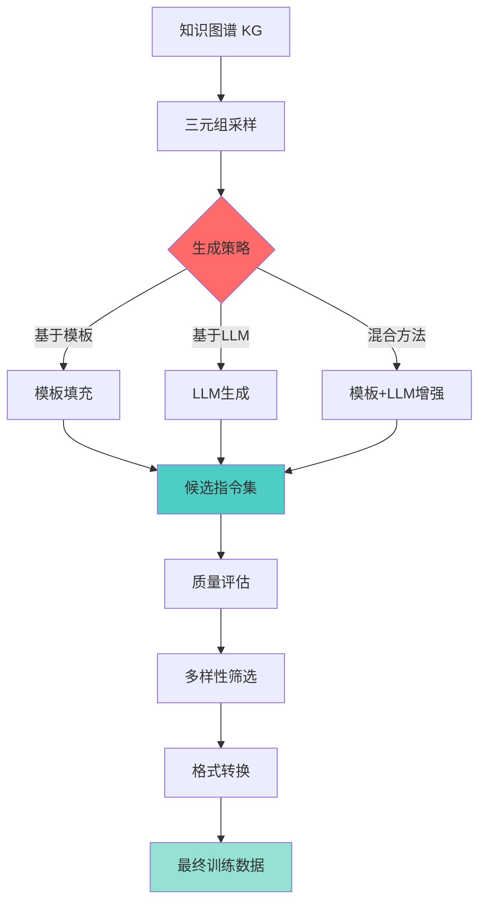

# KG2Instruct 原理详解

## 📚 核心概念

**KG2Instruct** 是 EasyInstruct 框架中的一个关键方法，它能够将**结构化的知识图谱（Knowledge Graph）**转换为**自然语言指令数据**，用于大语言模型的微调。

### 论文来源
- **论文**: [InstructIE: A Chinese Instruction-based Information Extraction Dataset](https://arxiv.org/abs/2305.11527)
- **机构**: 浙江大学 NLP 实验室 (zjunlp)
- **会议**: ACL 2024 System Demonstration Track

---

## 🎯 为什么需要 KG2Instruct？

### 问题背景

```
❌ 传统方法的痛点：
1. 人工标注指令数据成本高昂
2. 数据多样性不足
3. 领域专业知识难以覆盖
4. 数据一致性难以保证

✅ KG2Instruct 的解决方案：
1. 利用已有的知识图谱（免费的结构化知识）
2. 自动生成大量指令数据
3. 知识准确性有保证
4. 逻辑一致性强
```

---

## 🔧 核心原理

### 1. 输入：知识图谱三元组

知识图谱的基本单元是**三元组（Triple）**：

```
(主体实体, 关系, 客体实体)
(Subject, Relation, Object)

示例：
(爱因斯坦, 出生于, 德国)
(Einstein, born_in, Germany)

(爱因斯坦, 提出了, 相对论)
(Einstein, proposed, Theory of Relativity)

(爱因斯坦, 获得了, 诺贝尔奖)
(Einstein, won, Nobel Prize)
```

### 2. 转换过程

#### 阶段1: 三元组采样

```python
# 从知识图谱中采样三元组
kg_triples = [
    ("Einstein", "born_in", "Germany"),
    ("Einstein", "proposed", "Theory of Relativity"),
    ("Einstein", "won", "Nobel Prize, Physics, 1921")
]
```

#### 阶段2: 模板设计

KG2Instruct 使用**多样化的模板**将三元组转换为指令：

```python
# 模板类型1: 直接问答
template_1 = "Where was {subject} born?"
answer_1 = "{subject} was born in {object}."

# 模板类型2: 关系查询
template_2 = "What is the relationship between {subject} and {object}?"
answer_2 = "{subject} {relation} {object}."

# 模板类型3: 事实验证
template_3 = "Is it true that {subject} {relation} {object}?"
answer_3 = "Yes, that's correct. {subject} {relation} {object}."

# 模板类型4: 信息提取
template_4 = "Extract all relationships involving {subject}."
answer_4 = "{subject} has the following relationships: ..."
```

#### 阶段3: LLM 增强生成

使用大语言模型（如 GPT-4）进一步**增强和多样化**指令：

```python
# Prompt 给 LLM
prompt = f"""
给定知识三元组: (爱因斯坦, 出生于, 德国)

请生成5个不同类型的问答对，要求：
1. 问题多样化（简单问答、推理、对比等）
2. 答案详细且准确
3. 自然流畅的表达
4. 适合用于模型训练

输出格式：
[
  {{"instruction": "...", "output": "..."}},
  ...
]
"""

# LLM 生成结果
generated_data = [
    {
        "instruction": "爱因斯坦的出生地是哪里？",
        "output": "爱因斯坦出生于德国。他于1879年3月14日出生在德国乌尔姆。"
    },
    {
        "instruction": "为什么爱因斯坦与德国有关系？",
        "output": "爱因斯坦与德国有关系是因为他出生在德国。尽管他后来移民到瑞士和美国，但他的早期生活和教育都在德国度过。"
    },
    {
        "instruction": "比较爱因斯坦和牛顿的国籍",
        "output": "爱因斯坦出生于德国，后来成为瑞士和美国公民。而艾萨克·牛顿是英国人。两位伟大物理学家来自不同的国家，但都对科学做出了巨大贡献。"
    }
]
```

---

## 🏗️ 完整工作流程



---

## 💡 关键技术细节

### 1. 三元组选择策略

```python
class TripleSelectionStrategy:
    """三元组选择策略"""
    
    def random_sampling(self, kg, num_samples):
        """随机采样"""
        return random.sample(kg.triples, num_samples)
    
    def relation_balanced_sampling(self, kg, num_samples):
        """关系平衡采样 - 确保各种关系类型都被覆盖"""
        samples = []
        relations = kg.get_all_relations()
        samples_per_relation = num_samples // len(relations)
        
        for relation in relations:
            triples = kg.get_triples_by_relation(relation)
            samples.extend(random.sample(triples, min(samples_per_relation, len(triples))))
        
        return samples
    
    def entity_coverage_sampling(self, kg, num_samples):
        """实体覆盖采样 - 确保重要实体被覆盖"""
        important_entities = kg.get_high_degree_entities(top_k=100)
        samples = []
        
        for entity in important_entities:
            triples = kg.get_triples_by_entity(entity)
            samples.extend(random.sample(triples, min(3, len(triples))))
        
        return samples[:num_samples]
```

### 2. 指令生成模式

#### 模式 A: 单三元组 → 单指令

```python
# 最简单的 1:1 映射
triple = ("Einstein", "born_in", "Germany")

instruction = "Where was Einstein born?"
output = "Einstein was born in Germany."
```

#### 模式 B: 多三元组 → 单指令（推理型）

```python
# 需要组合多个知识点
triples = [
    ("Einstein", "born_in", "Germany"),
    ("Germany", "located_in", "Europe"),
    ("Einstein", "moved_to", "USA")
]

instruction = "Describe Einstein's geographical journey."
output = """
Einstein was born in Germany, which is located in Europe. 
Later in his life, he moved to the United States, crossing 
from Europe to North America.
"""
```

#### 模式 C: 单三元组 → 多指令（多样化）

```python
# 从一个三元组生成多种问法
triple = ("Einstein", "won", "Nobel Prize, Physics, 1921")

instructions = [
    {
        "instruction": "What award did Einstein win?",
        "output": "Einstein won the Nobel Prize in Physics in 1921."
    },
    {
        "instruction": "In which year did Einstein receive the Nobel Prize?",
        "output": "Einstein received the Nobel Prize in 1921."
    },
    {
        "instruction": "List Einstein's major achievements.",
        "output": "One of Einstein's major achievements was winning the Nobel Prize in Physics in 1921 for his explanation of the photoelectric effect."
    }
]
```

### 3. 质量控制机制

```python
class QualityControl:
    """质量控制流程"""
    
    def evaluate_instruction(self, instruction_data):
        """评估单条指令质量"""
        scores = {
            "factual_accuracy": self.check_factual_accuracy(instruction_data),
            "linguistic_quality": self.check_linguistic_quality(instruction_data),
            "diversity": self.check_diversity(instruction_data),
            "task_relevance": self.check_task_relevance(instruction_data)
        }
        return scores
    
    def check_factual_accuracy(self, instruction_data):
        """检查事实准确性 - 与原始KG对比"""
        # 验证生成的内容是否与KG一致
        # 使用 NLI 模型或回查 KG
        pass
    
    def check_linguistic_quality(self, instruction_data):
        """检查语言质量"""
        # 使用困惑度、语法检查等
        # 确保自然流畅
        pass
    
    def check_diversity(self, instruction_data):
        """检查多样性"""
        # 避免重复
        # 使用嵌入相似度
        pass
```

---

## 📊 EasyInstruct 中的实现

### 基本使用

```python
from easyinstruct import KG2InstructGenerator

# 初始化生成器
generator = KG2InstructGenerator(
    # 输入知识图谱文件
    kg_path="path/to/knowledge_graph.json",
    
    # 生成数量
    num_instructions_to_generate=1000,
    
    # 使用的模型
    engine="gpt-3.5-turbo",
    
    # 生成策略
    generation_mode="hybrid",  # template / llm / hybrid
    
    # 模板文件
    template_path="path/to/templates.json",
    
    # 输出路径
    output_path="data/generated_instructions.json"
)

# 执行生成
generator.generate()
```

### 知识图谱输入格式

```json
{
  "entities": [
    {"id": "E1", "name": "Einstein", "type": "Person"},
    {"id": "E2", "name": "Germany", "type": "Country"},
    {"id": "E3", "name": "Theory of Relativity", "type": "Theory"}
  ],
  "relations": [
    {
      "subject": "E1",
      "relation": "born_in",
      "object": "E2"
    },
    {
      "subject": "E1", 
      "relation": "proposed",
      "object": "E3"
    }
  ]
}
```

### 配置文件示例

```yaml
# configs/kg2instruct_config.yaml
generator:
  KG2InstructGenerator:
    kg_path: data/knowledge_graph.json
    output_path: data/generated/
    num_instructions_to_generate: 1000
    
    # 生成参数
    generation:
      mode: hybrid  # template, llm, hybrid
      temperature: 0.7
      max_tokens: 512
      
    # 模板配置
    templates:
      use_predefined: true
      custom_templates_path: configs/templates.json
      
    # 采样策略
    sampling:
      strategy: relation_balanced  # random, relation_balanced, entity_coverage
      triples_per_instruction: 1   # 1 or multiple
      
    # 质量控制
    quality:
      enable_filtering: true
      min_length: 10
      max_length: 512
      diversity_threshold: 0.8
      
    # LLM 配置
    engine: gpt-3.5-turbo
    api_key: ${OPENAI_API_KEY}
```

---

## 🎯 实际应用案例

### 案例 1: 医学知识图谱 → 医疗问答

```python
# 医学KG三元组
medical_kg = [
    ("阿司匹林", "用于治疗", "疼痛"),
    ("阿司匹林", "属于", "非甾体抗炎药"),
    ("阿司匹林", "副作用", "胃肠道不适"),
    ("阿司匹林", "禁忌症", "胃溃疡")
]

# 生成的医疗指令数据
generated_instructions = [
    {
        "instruction": "阿司匹林有什么作用？",
        "output": "阿司匹林主要用于治疗疼痛。它属于非甾体抗炎药（NSAIDs）类别，具有镇痛、消炎和退烧的作用。"
    },
    {
        "instruction": "服用阿司匹林需要注意什么？",
        "output": "服用阿司匹林时需要注意以下几点：1) 可能会出现胃肠道不适等副作用；2) 有胃溃疡病史的患者禁用；3) 建议随餐或餐后服用以减少胃部刺激。"
    },
    {
        "instruction": "为什么胃溃疡患者不能服用阿司匹林？",
        "output": "胃溃疡患者不能服用阿司匹林是因为阿司匹林可能导致胃肠道不适，甚至加重胃溃疡的病情。作为一种非甾体抗炎药，阿司匹林会抑制保护胃黏膜的前列腺素合成，从而增加胃部损伤的风险。"
    }
]
```

### 案例 2: 学术知识图谱 → 科研问答

```python
# 学术KG
academic_kg = [
    ("Transformer", "提出于", "2017年"),
    ("Transformer", "作者", "Vaswani等人"),
    ("Transformer", "发表于", "NeurIPS"),
    ("Transformer", "核心机制", "Self-Attention"),
    ("BERT", "基于", "Transformer"),
    ("GPT", "基于", "Transformer")
]

# 生成的学术指令
academic_instructions = [
    {
        "instruction": "Transformer模型是什么时候提出的？",
        "output": "Transformer模型于2017年提出，由Vaswani等人在NeurIPS会议上发表。"
    },
    {
        "instruction": "解释Transformer的核心创新",
        "output": "Transformer的核心创新是Self-Attention（自注意力）机制。这个机制允许模型在处理序列时同时关注所有位置，而不是像RNN那样顺序处理。这使得Transformer能够更好地捕捉长距离依赖关系，并且可以并行化计算，大大提高了训练效率。"
    },
    {
        "instruction": "BERT和GPT有什么共同点？",
        "output": "BERT和GPT的共同点是它们都基于Transformer架构。Transformer由Vaswani等人于2017年在NeurIPS上提出，其核心是Self-Attention机制。BERT和GPT都利用了Transformer的强大表示能力，但采用了不同的预训练策略。"
    }
]
```

---

## ⚖️ 优缺点分析

### ✅ 优点

1. **知识准确性高**
   - 基于人工验证的知识图谱
   - 事实错误率低

2. **逻辑一致性强**
   - KG本身保证了知识的一致性
   - 生成的数据不会自相矛盾

3. **可控性好**
   - 可以精确控制覆盖哪些知识点
   - 容易定位和修复问题

4. **成本效益高**
   - 利用已有的KG资源
   - 减少人工标注成本

5. **支持复杂推理**
   - 可以组合多个三元组
   - 生成多跳推理问题

### ❌ 缺点

1. **依赖KG质量**
   - 如果KG本身有错误，会传播到训练数据
   - KG的覆盖度限制了生成的范围

2. **多样性受限**
   - 模板化生成可能导致数据同质化
   - 需要大量工程优化来提升多样性

3. **表达能力受限**
   - KG只能表示结构化知识
   - 难以捕捉隐含知识和常识

4. **领域泛化困难**
   - 每个领域需要构建专门的KG
   - 迁移成本高

---

## 🆚 与其他方法对比

### KG2Instruct vs Self-Instruct

| 维度 | KG2Instruct | Self-Instruct |
|-----|-------------|---------------|
| **数据来源** | 知识图谱 | LLM自我生成 |
| **准确性** | ⭐⭐⭐⭐⭐ | ⭐⭐⭐ |
| **多样性** | ⭐⭐⭐ | ⭐⭐⭐⭐⭐ |
| **成本** | 需要KG构建成本 | 只需API成本 |
| **可控性** | ⭐⭐⭐⭐⭐ | ⭐⭐ |
| **适用场景** | 专业领域、事实性强 | 通用场景、创意性强 |

### KG2Instruct vs Backtranslation

| 维度 | KG2Instruct | Backtranslation |
|-----|-------------|-----------------|
| **输入** | 知识图谱 | 文档语料 |
| **结构化** | ⭐⭐⭐⭐⭐ | ⭐⭐ |
| **知识保证** | ⭐⭐⭐⭐⭐ | ⭐⭐⭐ |
| **实施难度** | 需要KG | 较简单 |
| **数据量** | 受KG规模限制 | 可扩展性强 |

---

## 🚀 最佳实践

### 1. KG 质量优化

```python
# 清理KG
def clean_kg(kg):
    """清理知识图谱"""
    # 1. 去重
    kg = remove_duplicate_triples(kg)
    
    # 2. 去除低质量三元组
    kg = filter_low_confidence_triples(kg, threshold=0.8)
    
    # 3. 规范化实体名称
    kg = normalize_entity_names(kg)
    
    # 4. 验证三元组一致性
    kg = validate_triple_consistency(kg)
    
    return kg
```

### 2. 模板多样化

```python
# 设计多样化模板
templates = {
    "born_in": [
        "{subject} was born in {object}.",
        "Where was {subject} born? In {object}.",
        "The birthplace of {subject} is {object}.",
        "{subject}'s place of birth: {object}.",
        "{subject} first saw the world in {object}."
    ],
    "proposed": [
        "{subject} proposed {object}.",
        "{subject} is the creator of {object}.",
        "The theory of {object} was developed by {subject}.",
        "{subject}'s groundbreaking work: {object}."
    ]
}
```

### 3. 混合策略

```python
def generate_with_hybrid_strategy(kg, num_samples):
    """混合生成策略"""
    results = []
    
    # 30% 模板生成（快速、稳定）
    template_samples = int(num_samples * 0.3)
    results.extend(generate_from_templates(kg, template_samples))
    
    # 50% LLM增强生成（质量高、多样）
    llm_samples = int(num_samples * 0.5)
    results.extend(generate_with_llm(kg, llm_samples))
    
    # 20% 推理型生成（复杂、多跳）
    reasoning_samples = num_samples - template_samples - llm_samples
    results.extend(generate_reasoning_questions(kg, reasoning_samples))
    
    return results
```

### 4. 后处理优化

```python
def post_process_instructions(instructions):
    """后处理优化"""
    # 1. 去重
    instructions = remove_duplicates(instructions)
    
    # 2. 多样性筛选
    instructions = diversity_filtering(instructions, threshold=0.85)
    
    # 3. 长度过滤
    instructions = filter_by_length(instructions, min_len=10, max_len=512)
    
    # 4. 质量评分
    instructions = score_quality(instructions)
    
    # 5. 排序和选择
    instructions = sort_and_select_top_k(instructions, k=1000)
    
    return instructions
```

---

## 📚 扩展阅读

1. **InstructIE 论文**: https://arxiv.org/abs/2305.11527
2. **EasyInstruct 文档**: https://zjunlp.gitbook.io/easyinstruct/
3. **EasyInstruct GitHub**: https://github.com/zjunlp/EasyInstruct
4. **DeepKE (KG构建工具)**: https://github.com/zjunlp/DeepKE

---

## 🎬 总结

**KG2Instruct 的核心价值**：

1. **桥接结构化知识和自然语言**
   - 将难以直接使用的KG转换为可训练的指令数据

2. **保证知识准确性**
   - 利用KG的结构化特性，确保生成数据的事实正确性

3. **支持专业领域**
   - 特别适合医疗、法律、科研等需要准确知识的领域

4. **可扩展性强**
   - 只要有KG，就能快速生成大量训练数据

**适用场景**：
- ✅ 有现成高质量KG
- ✅ 需要事实准确性
- ✅ 专业领域应用
- ✅ 可解释性要求高
- ✅ 知识密集型任务

**不适用场景**：
- ❌ 创意性内容生成
- ❌ 常识推理任务
- ❌ 缺乏KG资源
- ❌ 需要极高多样性

---

**结论**: KG2Instruct 是一个利用结构化知识生成高质量训练数据的有效方法，特别适合需要准确知识和可控生成的场景。结合其他方法（如 Self-Instruct、Backtranslation）使用，可以获得更好的效果。
